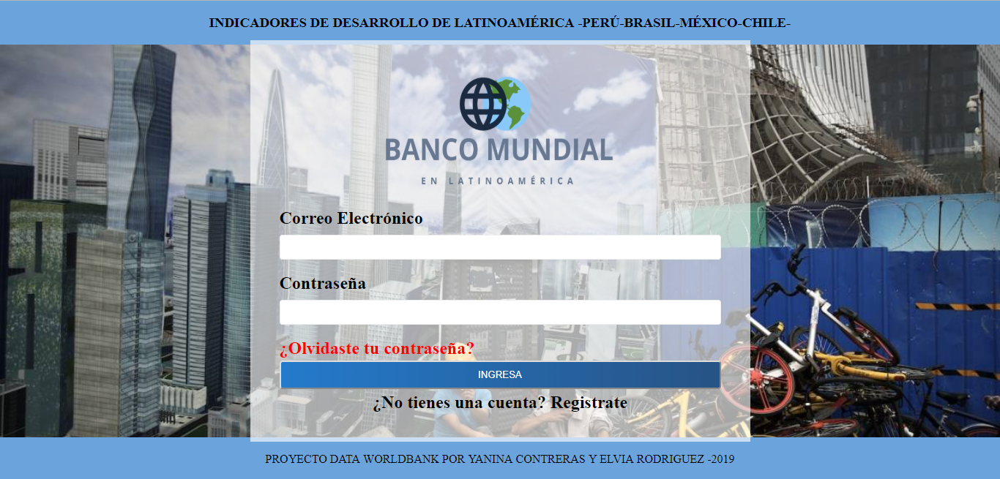
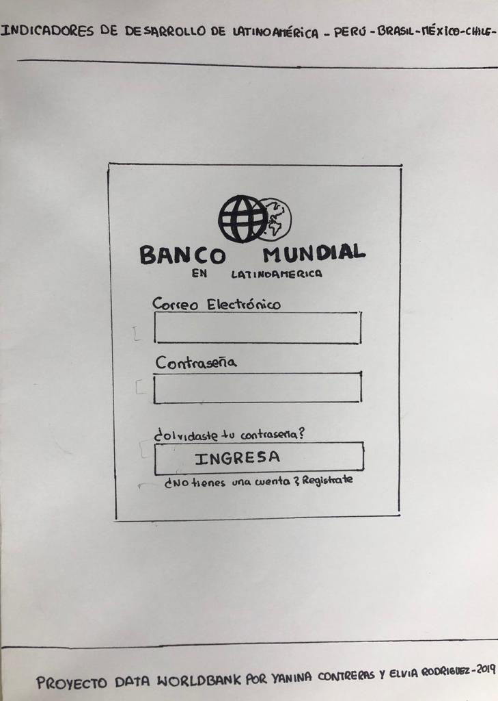
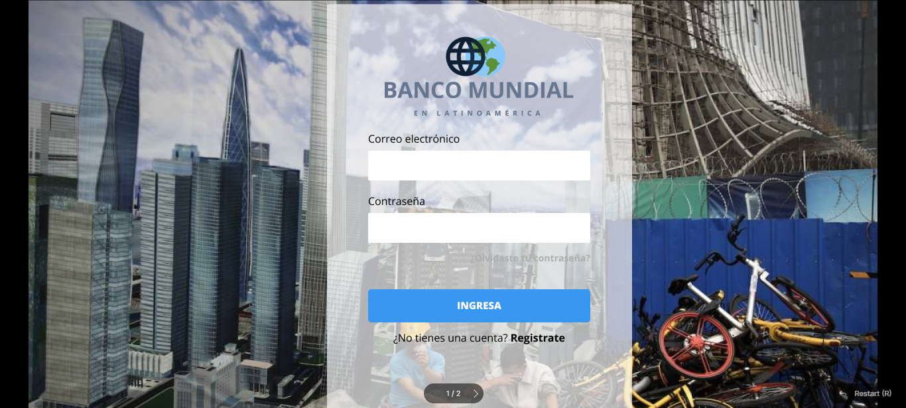

#BANCO MUNDIAL EN LATINOAMÉRICA

El proyecto facilita y muestra la busqueda de datos de manera ágil y dinámica de facil acceso y entendimiento para el usuario.

El usuario podrá iniciar sesión con el siguiente registro:
Usuario: LABORATORIA 
Contraseña: LABORATORIA

##IMAGEN FINAL DEL PROYECTO

##INVESTIGACION UX

Se ha relizado encuestas para enfocarnos en las necesidades especificas de cada usuario recopilando la siguiente información:

-Conseguir data para investigaciones  academicas (estudiantes).
-Conseguir data para la ejecución y planeamiento de proyectos de enfoque social (Gestores de proyectos)
-Conseguir data para decisiones políticas.
-Conseguir data verídica para la inversión de capital en los países designados (empresarios).

Este proyecto facilita la busqueda fácil y dinámica de la data del banco mundial ordenada y clasificada en cuatro paises latinoaméricanos Brasil, Perú, Chile, México.

PROTOTIPO DE BAJA FIDELIDAD

FEEDBACK 
Las sugerencias de los posibles usuarios apuntaron a la realización de un cambio en la estructura de la pantalla de logeo, así entonces, se decidió agregar un encabezado explicativo y un cambio en el tamaño de las letras del mismo.
PROTOTIPO DE ALTA FIDELIDAD 

https://www.figma.com/file/XOiAVuoNDQaYwAPIO0k0Fi/Data-lovers-(Copy)?node-id=1%3A2

